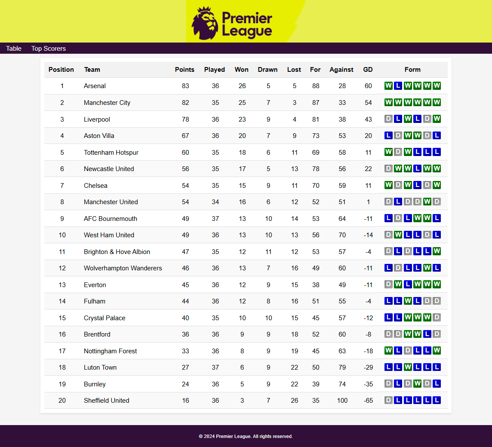

# Final Project: Internet Programming Module

This repository hosts my final project for the Internet Programming module. The project demonstrates a comprehensive approach to designing and implementing web interfaces using HTML, CSS, and JavaScript. I am proud to say that the project was perfected to an A+ standard.

## Project Structure

### Task 1: League Management & Statistics
- **League.html** – Main interface for league information.
- **League.css** – Styling for the league pages.
- **League.js** – JavaScript functionality for interactive elements.
- **league.json** – Data file with detailed league information.
- **Leagueschema.json** – Schema for validating league data.
- **PremierLeagueLogo.png** – Logo used for branding.
- **Topscorers.html** – Displays the top scorers within the league.

### Task 2: Form Handling & Reporting
- **sampleEntryForm.html** – Sample form for collecting user entries.
- **SelectionForm.html** – Interface for selecting options.
- **sampleReport.html** – Report page summarizing form submissions.
- **layout.css** – Consistent styling for Task 2 pages.
- **sampleEntryForm.jpeg, SelectionForm.jpeg, sampleReport.jpeg** – Screenshots illustrating the form designs and report layout.

## Features

- **Responsive Design:** Clean and responsive layouts to ensure usability on various devices.
- **Interactive Elements:** Use of JavaScript to enhance user interactions.
- **Data Validation:** Implementation of JSON schemas to ensure integrity of league data.
- **Effective Form Handling:** Demonstrates collecting, processing, and reporting user input.

## Usage

1. **Clone the Repository:**  
   Clone this repository to your local machine.

2. **Open the HTML Files:**  
   - For league management and statistics, open `Task1/League.html` or `Task1/Topscorers.html` in your browser.
   - For form handling and reporting, open any HTML file in the Task2 directory (e.g., `Task2/sampleEntryForm.html`).

3. **Maintain the Directory Structure:**  
   Ensure all assets (CSS, JavaScript, JSON, and image files) remain in their set directories to ensure the project works as intended.

## Acknowledgements

This project represents the culmination of my work in the Internet Programming module. The project stands as a demonstration of both technical skills and attention to design details. I am proud of this accomplishment and the learning journey behind it.

*Developed by [Your Name] – 2025*
